# PLING

by sonomato

08.01.2019

Product version: **Pling** 0.1.45

[sonomato.de/PLING](https://sonomato.de/pling)

# Info and Documentation

## Instrument

**Pling** is a precisely recorded music box with unusual playability and the lovely plessure of a divine voice kissed by a kitten.

*bild*

Recorded with an arsenal of high quality studio microphones we definitly shoot some sparrows with cannons[^1], but ensured to capture the refined sound architecture of this instrument.

*bild*

The colorful reverb comes from a little church in france and allows the tonality to open up in some euphonic shapes.

*bild*

## Features

- Mac OS X and Windows 32/64bits VST, AU and Standalone Application
- Two Noise Looper
- High Quality Audio Recordings
- Real Stereo Convolution Reverb
- Other Usefull Stuff

# Table of Contents

[TOC]

# System Requirements

Our Instruments are provided for Mac OS X Plug-In format AU, VST2 and VST3. As well as Microsoft Windows 32/64bits VST2 and VST3. We recommend Mac OS 10.8 or newer and Microsoft Windows 7 or newer to run this application.

# Installation

## Plug-In Installation 

### Package Installation Mac OS X

AU, VST and Standalone: 

Launch the setup by double clicking the installer file (**.pkg**) and click *Continue*. 
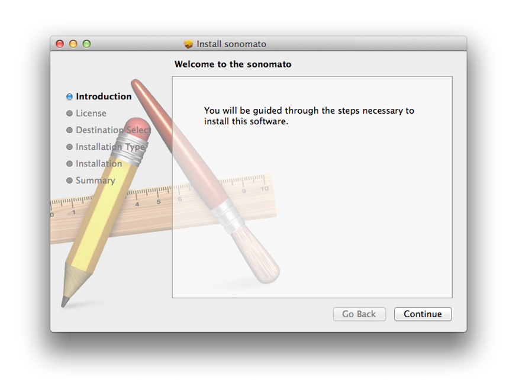

After reading the license agreement, click *Agree* to follow the installation.
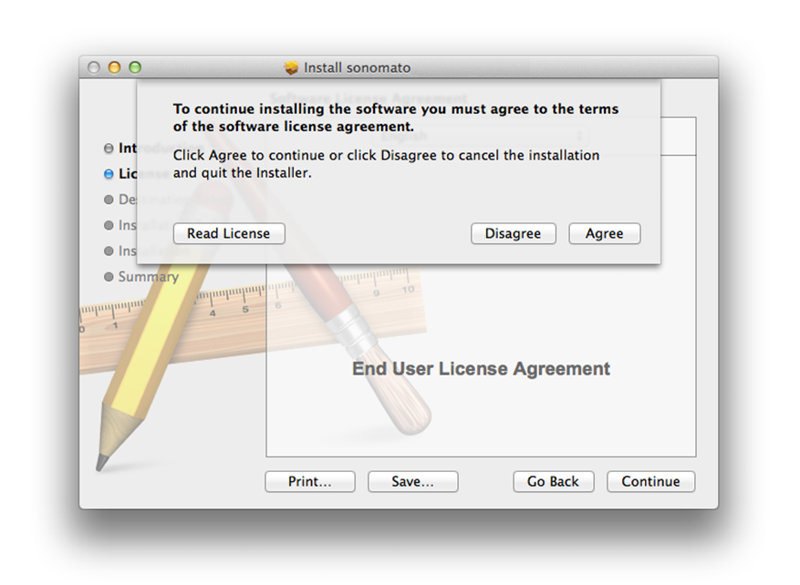

If needed, select the disk where you want the application to be installed before choosing which type of package you want to install and click *Continue*.
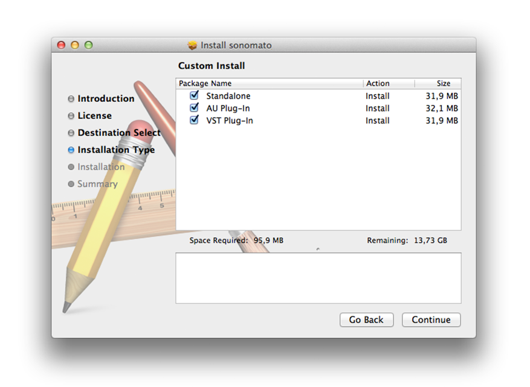

Confirm the choosen selection and click *Install* to start the installation.
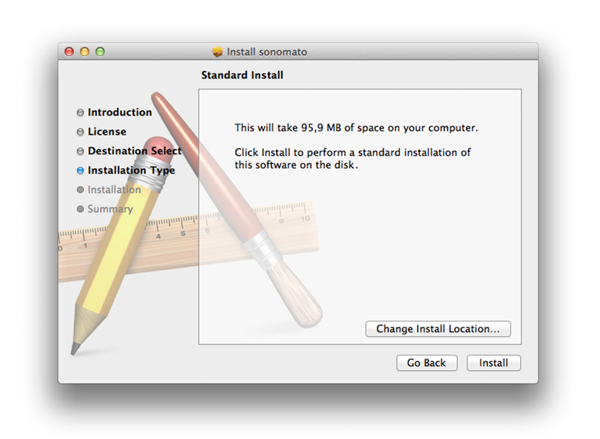

If your current user account does not have permission to install this application, log in as administrator and click *Install Software*.
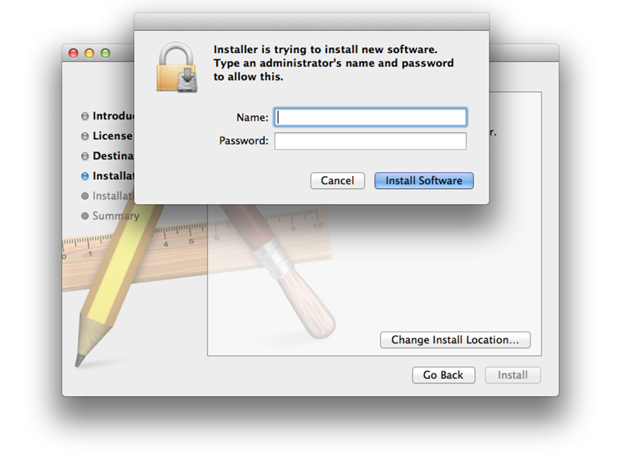

After the installation process is comlpeted click *Close*.
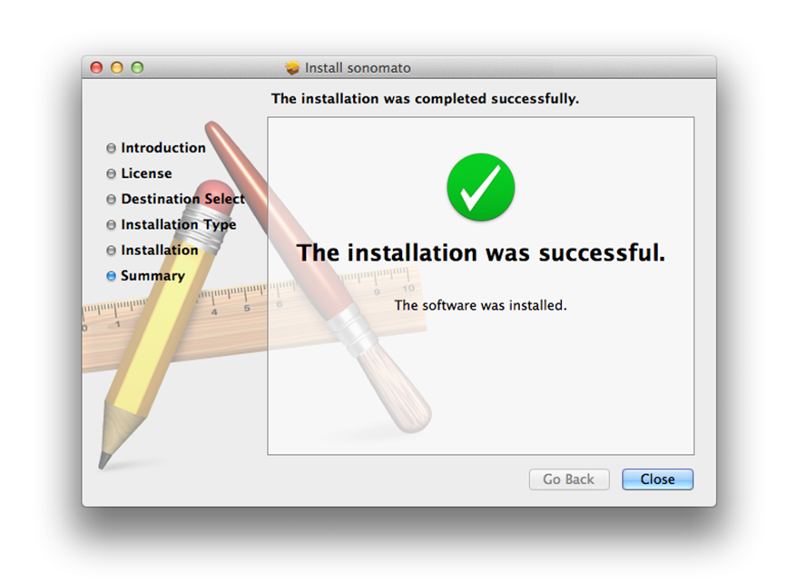

### Package Installation Windows 32/64bit

VST and Standalone:

Launch the setup by double clicking the installer file (**.exe**) and accept the license agreement after reading it, then click *next*.

*bild*

Choose the location for the 32 bit VST plugin version and click *next*.

*bild*

Choose the location for the 64 bit VST plugin version and click *next*.

*bild*

Select the components you would like to install and click *next*.

*bild*

Click *install* to start the installation.

*bild*

Click *finish* when installation ist complete.

*bild*

### Manual Installation

For manual installation of the AU and VST Version of this Plug-In, place the **.component** and **.vst** files in the following directory:

**Mac OS X**:

*~/Library/Audio/Plug-Ins/Components*

*~/Library/Audio/Plug-Ins/VST*

After restarting your DAW, the Plug-In should automatically be validated.

For the Standalone Version of the Instrument place the **.app** file in the program folder and rightclick to open the app for the first time.

**Windows 32/64bit**

**.dll** in Steinbergs VST Ordner..

## Sample Library Installation

### Sample Archive Installation

This Plug-In comes with it's own Sample Archive file (**.hr**) which contains the sample library. 

First open the Plug-In or Standalone app you previously installed and click on *Install Samples*.

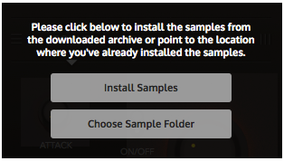

Then locate to the Sample Archive file (**.hr**) and after confirming you'll be asked to select a destination folder, where the samples will be placed. This doesn't have to be the same folder where you previously installed the Plug-In. Finally confirm with *OK* to extract the samples to their new location.

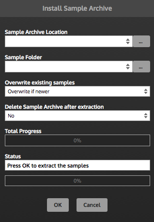

**Other options**:

*Overwrite existing samples* comes in handy when you reinstall or update the sample library. For the first installation leave it at default value.

*Delete Sample Archive after extration* can be choosen according to your preference, the **.hr** File is only for installation purpose and can be deleted after the library is installed.

After the sample library installation the dialog: **"*The sample directory does not exist*"** may appear on your screen, click the *Ignore* button and reopen the application. 

### Change Sample Folder Location

To change the sample folder location, move the sample folder to its new destination and delete the specific link file **LinkOSX**, **LinkWindows**, or **LinkLinux** in the following directory: 

**Mac OS X**:

*~/Library/Application Support/sonomato/* 

**Windows 32/64bit**:

*Users/AppData/Roaming/sonomato/*

**Linux**:

*/home/username/.config/sonomato/*

After deleting the link file reopen the application and click *Choose Sample Folder*. Now lead to the new destination folder of the sample library and restart the application.

### Reinstall Sample Library

To reinstall the sample library delete the specific link file **LinkOSX**, **LinkWindows**, or **LinkLinux** in the following directory: 

**Mac OS X**:

*~/Library/Application Support/sonomato/* 

**Windows 32/64bit**:

*Users/AppData/Roaming/sonomato/*

**Linux**:

*/home/username/.config/sonomato/*

After deleting the link file reopen the application and click *Install Samples*. Now start again with chapter **Sample Archive Installation**. 

## Uninstallation

### Uninstallation Mac OS X

To uninstall this application delete the **.component** and **.vst** files from your plugin directories: 

*~/Library/Audio/Plug-Ins/Components*

*~/Library/Audio/Plug-Ins/VST*

And the standalone application (**.app**) from your program folder.

Remove the sample library folder from your choosen directory. By default you can find this folder under:

*~/Music/sonomato/*

And delete the application support files in the following directory:

*~/Library/Application Support/sonomato/* 

### Uninstallation Windows 32/64bit

1. :\Program Files\Common Files\VST3 and the VST2 directories that you choose during installation. By default,

thoseVST2directorieswillbe C:\Program Files\Steinberg\VSTPlugins or C:\Program Files (x86)\Steinberg\VSTPlugins . 

# Use the Instrument

## Global Controls

The rudimentary controls of the global section are self-explanatory labeled with an ON/OFF switch to bypass **Pling** and a MASTER knob to control the overall output volume. The MIDI and AUDIO lights practically indicate any incoming or outgoing signal.

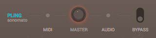

## Sound Section

Beneath the sound section the envelope control knobs ATTACK and DECAY permit **Pling** to morph from a percussive to a nearly muted sound. The REVERB AMOUNT knob which could be bypassed with its own ON/OFF switch, also takes care of the overall volume to ensure that the reverb tail doesn't override the stereo output. 

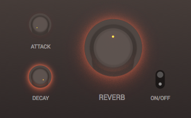

## Noise Section

The Noise Section contains two seperate Loop Player which can be enabled via ON/OFF switch, panned left and right and independently controlled in volume. Each Loop can be modified via START and END, which gives **PLING** a large scope for atmospheric scapes.

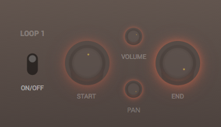

## Settings

Inside the Settings a MASTER TUNING knob changes the overall pitch up or down one octave via semitone steps. Alternating the pitch can lead to interesting results and expands the bandwidth of **PLING**.

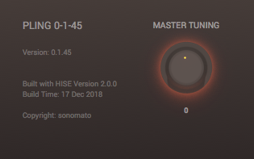

## MIDI Charts

| Function     | MIDI note number / CC messages |
| ------------ | ------------------------------ |
| Key F#3-F6   | 66-101                         |
| Modwheel     | CC1                            |
| Sustainpedal | CC64                           |

# EULA

[^1]: No sparrows or other living creatures were harmed during the making of this Instrument.

# Contact and Support

sonomato

Spichernstrasse 2

D-50672 Cologne

Germany

www.sonomato.de

[team@sonomato.de](mailto:team@sonomato.de)

# Credits

your name here

