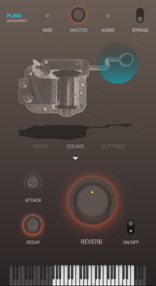

# PLING

by sonomato
Product version:  0.1.45

[sonomato.de/PLING](https://sonomato.de/pling)

Manual: 15.01.2019

# Info and Documentation

## Instrument

**PLING** is a precisely recorded music box with unusual playability and the lovely plessure of a divine voice kissed by a kitten.

Recorded with an arsenal of high quality studio microphones we definitly shoot some sparrows with cannons[^1], but ensured to capture the refined sound architecture of this instrument.

The colorful reverb comes from a little church in france and allows the tonality to open up in some euphonic shapes.

## Features

- High Quality Audio Recordings
- Real Stereo Convolution Reverb
- Two Noise Looper

# System Requirements

Our Instruments are provided for Mac OS X Plug-In format AU, VST2. We recommend Mac OS 10.8 or newer.

# Installation

## Plugin – Installation

1. Download Intrument:

   AU:

   VST:

2. Unpack Zip.

3. Copy the plugin in your AU- / VST-plugins-folder:

   **AU-Path:**

   *~/Library/Audio/Plug-Ins/Components/*

   **VST-Path**

   ~/Library/Audio/Plug-Ins/VST/

4. Restart your DAW. The Plug-In should automatically be validated.

## Samples – Installation

1. Download sample-archive:
2. Open the Plug-In 
3. Click on *Install Samples*.

4. Locate the downloaded sample-archive (**.hr**)-file

5. Select a destination folder, where the sample-archive will be extracted to. (This doesn't have to be the same folder where you previously installed the Plug-In).

6. Finally confirm with *OK* to extract the samples to their new location.

7. The dialog: **"*The sample directory does not exist*"** may appear on your screen. Click the *Ignore* button and reopen/reload the plugin. The samples should be available now. 

### Change Sample Folder Location

To change the sample folder location, move the sample folder to its new destination and delete the specific link file **LinkOSX** in the following directory: 

*~/Library/Application Support/sonomato/* 

After deleting the link file reopen the application and click *Choose Sample Folder*. Now lead to the new destination folder of the sample library and restart the application.

### Reinstall Sample Library

To reinstall the sample library delete the **LinkOSX** file in the following directory: 

*~/Library/Application Support/sonomato/* 

After deleting the link file reopen the application and click *Install Samples*. Now start again with chapter **Samples - Installation**. 

## Uninstallation

To uninstall this application delete the **.component** and **.vst** files from your plugin directories: 

*~/Library/Audio/Plug-Ins/Components*

*~/Library/Audio/Plug-Ins/VST*

Remove the sample library folder from your choosen directory. By default you can find this folder under:

*~/Music/sonomato/*

And delete the application support files in the following directory:

*~/Library/Application Support/sonomato/* 

# Use the Instrument

## Global Controls

The rudimentary controls of the global section are self-explanatory labeled with an ON/OFF switch to bypass **Pling** and a MASTER knob to control the overall output volume. The MIDI and AUDIO lights practically indicate any incoming or outgoing signal.

## Sound Section

Beneath the sound section the envelope control knobs ATTACK and DECAY permit **Pling** to morph from a percussive to a nearly muted sound. The REVERB AMOUNT knob which could be bypassed with its own ON/OFF switch, also takes care of the overall volume to ensure that the reverb tail doesn't override the stereo output. 

## Noise Section

The Noise Section contains two seperate Loop Player which can be enabled via ON/OFF switch, panned left and right and independently controlled in volume. Each Loop can be modified via START and END, which gives **PLING** a large scope for atmospheric scapes.

## Settings

Inside the Settings a MASTER TUNING knob changes the overall pitch up or down one octave via semitone steps. Alternating the pitch can lead to interesting results and expands the bandwidth of **PLING**.

## MIDI Charts

| Function     | MIDI note number / CC messages |
| ------------ | ------------------------------ |
| Key F#3-F6   | 66-101                         |
| Modwheel     | CC1                            |
| Sustainpedal | CC64                           |

# EULA

[^1]: No sparrows or other living creatures were harmed during the making of this Instrument.

# Support

**sonomato**
Spichernstrasse 2
D-50672 Cologne
Germany

www.sonomato.de